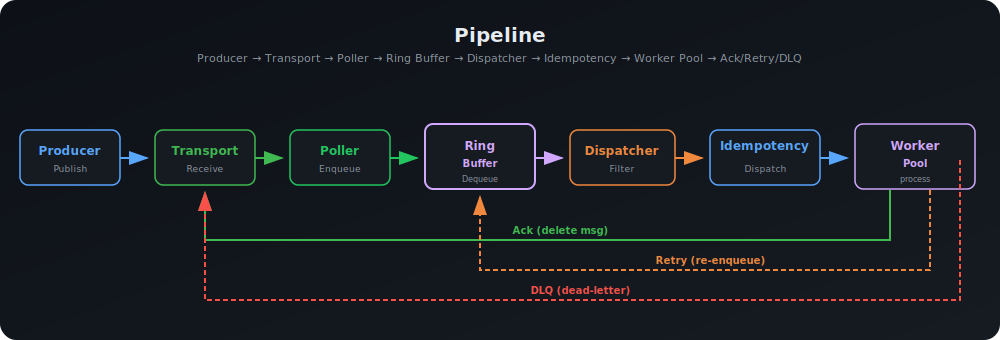

# go-task-orbit

[](https://github.com/vianhanif/go-task-orbit/actions/workflows/e2e.yml)
[](https://goreportcard.com/report/github.com/vianhanif/go-task-orbit)
[](https://pkg.go.dev/github.com/vianhanif/go-task-orbit)
[](LICENSE)

Cloud-native async execution runtime for Go — ring-buffer scheduling, pluggable transport backends (SQS, Pub/Sub, In-Memory).


## Overview

`go-task-orbit` is a cloud-native async execution runtime that combines cloud message brokers with in-process ring-buffer scheduling. It replaces the legacy `go-workers` library with bounded concurrency, predictable latency, and multi-cloud support.

### Architecture

```
Transport (SQS / Pub/Sub / In-Memory) → Ring Buffer → Idempotency Filter → Worker Pool → Ack/Retry/DLQ
```

### Pipeline



> See [docs/architecture.md](docs/architecture.md) for detailed flow diagrams (receive loop, retry lifecycle, shutdown sequence).

### Implementation

The ring buffer is a bounded circular queue using a mutex for enqueue/dequeue with atomics for lock-free `Len()` visibility. Power-of-two sizing enables bitwise AND masking (`index = seq & (capacity-1)`) — no division overhead. Overflow behavior is configurable: Block, DropNewest, DropOldest, or Reject. Workers are a fixed goroutine pool with channel-based task submission. The current design prioritizes simplicity and predictable behavior over fully lock-free complexity — suitable for IO-bound workloads where dispatch overhead is negligible relative to handler execution time.


### Why Ring Buffer?

Traditional Go worker libraries often use channels or goroutine-per-message patterns. These scale poorly under load:

| Pattern | Problem |
|---|---|
| `go handler(msg)` | Unbounded goroutine creation → CPU thrashing, memory spikes |
| `ch <- msg` | Single consumer, no fan-out, blocks producer on backpressure |
| `for msg := range ch` | No batch reads, poor cache locality, no overflow policies |

The ring buffer solves this by:

- **Bounded memory** — pre-allocated, fixed-size, never grows. No GC pressure.
- **Batch I/O** — drain N items in one pass. 10x fewer dispatcher wake-ups.
- **Cache locality** — contiguous slots. CPU prefetcher works.
- **Overflow policies** — Block, DropNewest, DropOldest, or Reject when full. Channels only block.
- **Predictable latency** — no heap allocation per message, no goroutine scheduling jitter.

> See [RING-BUFFER.md](RING-BUFFER.md) for detailed comparisons, flow diagrams, and performance analysis.

## Quick Start

### AWS SQS

```go
import (
    "github.com/vianhanif/go-task-orbit/ringq"
    "github.com/vianhanif/go-task-orbit/transport/sqs"
)

pipeline := ringq.New().
    Transport(sqs.New(sqs.Config{
        QueueURL: "https://sqs.us-east-1.amazonaws.com/123456789/orders-main",
        DLQURL:   "https://sqs.us-east-1.amazonaws.com/123456789/orders-dlq",
    })).
    Handle("email.send", ringq.Wrap(SendEmailHandler)).
    Concurrency(64).
    BufferSize(4096)

pipeline.Run(ctx)
```

### GCP Pub/Sub

```go
import (
    "github.com/vianhanif/go-task-orbit/ringq"
    "github.com/vianhanif/go-task-orbit/transport/pubsub"
)

transport, _ := pubsub.New(ctx, pubsub.Config{
    ProjectID:      "my-project",
    TopicID:        "orders",
    SubscriptionID: "orders-sub",
})

pipeline := ringq.New().
    Transport(transport).
    Handle("email.send", ringq.Wrap(SendEmailHandler)).
    Concurrency(64).
    BufferSize(4096)

pipeline.Run(ctx)
```

### Local Development

```go
import "github.com/vianhanif/go-task-orbit/transport/memory"

pipeline := ringq.New().
    Transport(memory.New()).
    Handle("email.send", ringq.Wrap(SendEmailHandler)).
    Concurrency(4).
    BufferSize(1024)

pipeline.Run(ctx)
```

## Transport Backends

| Backend | Status | Protocol | Use case |
|---|---|---|---|
| **Amazon SQS** | Supported | HTTP (REST) | AWS production — batch receive/ack, native DLQ |
| **GCP Pub/Sub** | Supported | gRPC | GCP production — streaming pull, subscription-level DLQ |
| **In-Memory** | Supported | In-process | Development / testing — zero dependencies |
| **Redis Streams** | Supported | TCP (RESP) | Durable Redis job processing — consumer groups, XACK, replay |
| **Redis Pub/Sub** | Supported | TCP (RESP) | Fire-and-forget real-time broadcast messaging |
| Kafka | Planned | TCP | Event-driven architectures |
| MySQL | Planned | TCP | Transactional job queues |

> See [docs/transports.md](docs/transports.md) for detailed transport comparison, selection guide, and implementation specifics.

## Features

- **Multi-cloud transport** — SQS (batch I/O), Pub/Sub (gRPC streaming), In-Memory (dev/test)
- **Ring buffer scheduler** — power-of-two sizing, bitwise AND mask, atomic visibility, configurable overflow policies
- **Bounded concurrency** — configurable worker pool, no goroutine leaks
- **Pipeline builder API** — chainable configuration with topic-based handler routing
- **Library-managed idempotency** — dedupe via message attributes, pluggable store (in-memory, Redis)
- **Explicit result model** — Ack, Retry, RetryWithDelay, DLQ
- **Hook-based observability** — wire up OpenTelemetry, logging, or metrics via lifecycle hooks (no OTel SDK dependency)
- **At-least-once delivery** — idempotency layer handles deduplication
- **Graceful shutdown** — SIGTERM-aware draining for EKS/GKE/Kubernetes
- **Type-safe handlers** — Go generics with pluggable codec (JSON default, raw bytes supported)
- **E2E tested** — 13 integration tests across SQS and Pub/Sub against real cloud emulators

## Handler Example

```go
type EmailPayload struct {
    To      string `json:"to"`
    Subject string `json:"subject"`
    Body    string `json:"body"`
}

func SendEmailHandler(ctx context.Context, msg EmailPayload) ringq.Result {
    if err := email.Send(msg.To, msg.Subject, msg.Body); err != nil {
        return ringq.Result{Action: ringq.Retry, Err: err}
    }
    return ringq.Result{Action: ringq.Ack}
}
```

## Retry & DLQ

Handlers return a `Result` with one of four actions:

| Action | Behavior | Transport interaction |
|---|---|---|
| `Ack` | Message deleted from queue | SQS: `DeleteMessageBatch` / Pub/Sub: `msg.Ack()` |
| `Retry` | Re-enqueued into ring buffer | No transport call — local ring re-insert |
| `RetryWithDelay` | Re-enqueued after delay | SQS: `ChangeMessageVisibility` / Pub/Sub: `msg.Nack()` |
| `DLQ` | Routed to dead letter queue | SQS: `SendMessage` to DLQ URL / Pub/Sub: `msg.Nack()` (subscription DLQ policy) |

### Exponential Backoff (Default)

Retry delays grow exponentially: `min(baseDelay * 2^(attempt-1), 5min)`. Default: 10 max retries, 1s base delay.

```
Attempt 1 → immediate
Attempt 2 → 1s delay
Attempt 3 → 2s delay
Attempt 4 → 4s delay
...
Attempt 10 → 256s delay (capped at 5min)
Attempt 11 → DLQ
```

Override via `HandleWithRetry(topic, handler, maxRetries, baseDelay, coordinator)`.

### Retry State

Retry state is **in-memory** (`ringq.Message.Attempts`). For SQS/Pub/Sub, transport redelivery resets the counter. The idempotency layer prevents duplicate side effects. Handlers should remain idempotent regardless.

> See [docs/retries.md](docs/retries.md) for transport-specific retry behavior, DLQ routing per transport, and detailed state-machine flow.

### Failure Semantics

Async systems are judged by how they fail. Here are the guarantees and edge cases:

| Scenario | Behavior | Guarantee |
|---|---|---|
| Crash before Ack | Transport redelivers → handler runs again | At-least-once. Idempotency layer prevents duplicate side effects. |
| Crash between Mark and Ack | IdemStore already persisted → duplicate filtered on redelivery | No duplicate processing. |
| Visibility timeout expiry | SQS/Pub/Sub redeliver the message | Safe — idempotency or retry handles it. |
| Max retries exceeded | Message routed to DLQ (SQS: separate queue, Pub/Sub: subscription DLQ topic) | No silent drops — DLQ is always attempted. |
| Ring buffer overflow | Drop/Block/Reject policy activates | Predictable — never crashes, never unbounded memory. |
| Poison message (always fails) | Attempts exhausted → DLQ | Stops retry amplification. Handler code responsible for idempotency. |
| Graceful shutdown during processing | Inflight handlers complete, then workers exit | Drains active work — no mid-flight kills. |
| Pod restart (backed transports) | SQS/Pub/Sub redeliver unacked messages | Messages survive restart. |
| Pod restart (InMemory transport) | Messages in ring/timer are lost | No durability guarantee for InMemory — design intent. |

**Key principle:** handlers should be idempotent regardless. The library provides the mechanisms (idempotency, retry, DLQ) — the handler is responsible for side-effect safety.

## Idempotency

The library manages deduplication via a pluggable `IdemStore`. The key is read from message attributes (configurable name, default `IdempotencyKey`).

```go
// Single pod (dev/test):
pipeline.Idempotency(ringq.IdempotencyConfig{
    Store:        idempotency.NewMemoryStore(),
    AttributeKey: "IdempotencyKey",
    TTL:          24 * time.Hour,
})

// Multi-pod production (>1 replica):
pipeline.Idempotency(ringq.IdempotencyConfig{
    Store:        idempotency.NewRedisStore(redisClient, "idem:"),
    AttributeKey: "IdempotencyKey",
    TTL:          24 * time.Hour,
})
```

> **Important:** `MemoryStore` is pod-local. In multi-replica deployments, use `RedisStore`.

### Failure Windows

Idempotency prevents duplicate processing within the library lifecycle, but there are edge cases handlers should account for:

| Scenario | Can duplicate? | Why |
|---|---|---|
| Normal flow | No | IdemStore checked before handler, marked after Ack |
| Crash between handler success and Ack | **Yes** | Transport redelivers unacknowledged message |
| Crash between Mark and Ack | No | Mark already persisted, duplicate filtered on redelivery |
| Multi-pod with MemoryStore | **Yes** | Each pod has independent in-memory store |

**Best practice:** handlers should be side-effect safe regardless. For example, use idempotency keys in external API calls, or make database writes idempotent via `INSERT ... ON CONFLICT DO NOTHING`.

## Build Tool

This project uses [Task](https://taskfile.dev/) as the build tool:

```bash
task lint        # go vet
task test        # unit tests
task test-race   # unit tests with race detector
task e2e         # AWS SQS e2e (requires Docker + Floci)
task e2e-gcp     # GCP Pub/Sub e2e (requires Docker + GCloud emulator)
task e2e-all     # all e2e tests
task all         # lint + test + e2e
```

## Benchmarks

Quick reference from `go test -bench=. ./bench/` (Intel i5-8257U, 4-core/8-thread, Go 1.21):

| Benchmark | ns/op | Throughput |
|---|---|---|
| Ring buffer single enqueue/dequeue | 63 | ~15.7M ops/s |
| Ring buffer batch (10 items) | 365 | ~27.4M msg/s |
| Full pipeline (64 workers, InMemory) | 395 | ~2.5M msg/s |
| Go channel (single) | 121 | ~8.3M ops/s |
| Goroutine per message | 314 | ~3.2M ops/s |

Ring buffer batch operations are **3.3x faster** than equivalent Go channel batches. Full pipeline throughput includes transport publish, ring buffer, dispatch, worker execution, and handler — all bounded by the worker pool.

> See [RING-BUFFER.md](RING-BUFFER.md) for full benchmark methodology, latency distribution, and analysis.

## Status

| Component | Status |
|---|---|
| Core types & interfaces | Done |
| Ring buffer scheduler | Done |
| Worker pool | Done |
| Pipeline builder API | Done |
| Retry engine + DLQ | Done |
| Exponential backoff | Done |
| Idempotency layer | Done |
| Graceful shutdown | Done |
| ETA delayed tasks (timer wheel) | Done |
| SQS transport | Done |
| GCP Pub/Sub transport | Done |
| In-Memory transport | Done |
| SQS E2E tests (Floci) | Done |
| GCP E2E tests (Google Emulator) | Done |
| GitHub Actions CI | Done |
| Redis Streams | Done |
| Redis Pub/Sub | Done |
| Kafka | Planned |

## Comparison

| Library | Model | Scheduling | Transport | Best for |
|---|---|---|---|---|
| **go-task-orbit** | Ring buffer + bounded workers | Lock-minimized, overflow policies | SQS, Pub/Sub, In-Memory | Cloud-native async execution |
| [go-workers](https://github.com/jrallison/go-workers) | Redis polling | Goroutine pool | Redis only | Sidekiq-compatible jobs |
| [Asynq](https://github.com/hibiken/asynq) | Redis queues | Task retry with backoff | Redis only | Reliable task queues |
| [Temporal](https://temporal.io/) | Workflow engine | Durable state machines | Multi-protocol | Complex orchestrations |
| [Watermill](https://github.com/ThreeDotsLabs/watermill) | Pub/Sub messaging | Event-driven | Kafka, RabbitMQ, Go channels | Event streaming |
| Raw Go channels | In-process | Blocking send/receive | None | Simple goroutine sync |

**Key differentiators:**

- **Bounded concurrency** — no goroutine explosion. Asynq/go-workers use Redis BRPOP which spawns goroutines per job.
- **Transport agnostic** — same API for SQS, Pub/Sub, In-Memory. Most alternatives are Redis-coupled.
- **Ring buffer scheduling** — predictable latency and backpressure. Channels/Temporal don't provide buffer-level overflow policies.
- **Not a workflow engine** — lighter than Temporal, no DAG orchestration, no durable state machines. Designed for microservice workloads.

## License

MIT
