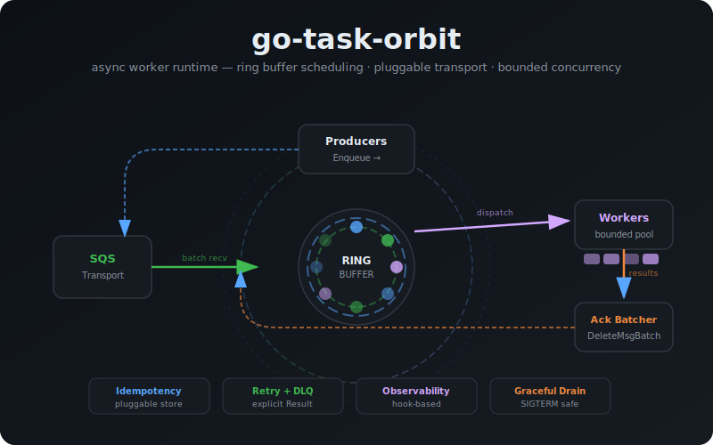

# go-task-orbit

Async worker library for Go with ring-buffer scheduling and pluggable transport backends.

**Module:** `github.com/vianhanif/go-task-orbit`

**Go:** 1.19+



## Overview

`go-task-orbit` is an async job processing runtime that combines SQS durability with in-process ring-buffer scheduling. It replaces the legacy `go-workers` library with a modern, observable, cloud-native architecture.

### Architecture

```
SQS (transport) → Ring Buffer (scheduler) → Idempotency Filter → Worker Pool → Ack/Retry/DLQ
```

- **Transport** handles durability, cross-pod delivery, and batch I/O
- **Ring buffer** handles local scheduling, backpressure, and concurrency control
- **Worker pool** provides bounded goroutine execution (no goroutine explosion)

## Quick Start

```go
package main

import (
    "context"
    "os"
    "os/signal"

    "github.com/vianhanif/go-task-orbit/ringq"
    "github.com/vianhanif/go-task-orbit/transport/sqs"
    "github.com/vianhanif/go-task-orbit/idempotency"
)

func main() {
    ctx, cancel := signal.NotifyContext(context.Background(), os.Interrupt)
    defer cancel()

pipeline := ringq.New().
    Transport(sqs.New(sqs.Config{
        QueueURL: "https://sqs.us-east-1.amazonaws.com/123456789/orders-main",
        DLQURL:   "https://sqs.us-east-1.amazonaws.com/123456789/orders-dlq",
    })).
    Handle("email.send", ringq.Handler[EmailPayload](SendEmailHandler)).
    Handle("invoice.generate", ringq.Handler[InvoicePayload](GenerateInvoiceHandler)).
    Idempotency(ringq.IdempotencyConfig{
        Store:        idempotency.NewMemoryStore(),
        AttributeKey: "IdempotencyKey",
        TTL:          24 * time.Hour,
    }).
    Concurrency(64).
    BufferSize(4096)

pipeline.Run(ctx)
}
```

## Transport Backends

| Backend | Status | Use case |
|---|---|---|
| **Amazon SQS** | Supported | Production — durable, scalable, cross-pod delivery |
| **In-Memory** | Supported | Development / testing — zero dependencies |
| Redis Streams | Planned | Alternative production transport |
| Kafka | Planned | Event-driven architectures |
| MySQL | Planned | Transactional job queues |

## Features

- **SQS-native** — batch receive, batch ack, batch visibility extension, native DLQ
- **In-memory ring buffer** — low-latency local scheduling, no Redis dependency
- **Bounded concurrency** — configurable worker pool, no goroutine leaks
- **Pipeline builder API** — chainable configuration with topic-based handler routing
- **Library-managed idempotency** — dedupe via SQS MessageAttributes, pluggable store
- **Explicit result model** — Ack, Retry, RetryWithDelay, DLQ
- **Hook-based observability** — wire up OpenTelemetry, logging, or metrics via lifecycle hooks (no OTel SDK dependency)
- **At-least-once delivery** — SQS standard queues with idempotency layer for deduplication
- **Graceful shutdown** — SIGTERM-aware draining for EKS/Kubernetes
- **Type-safe handlers** — Go generics with pluggable codec (JSON default, raw bytes supported)

## Handler Example

```go
type EmailPayload struct {
    To      string `json:"to"`
    Subject string `json:"subject"`
    Body    string `json:"body"`
}

func SendEmailHandler(ctx context.Context, msg EmailPayload) ringq.Result {
    if err := email.Send(msg.To, msg.Subject, msg.Body); err != nil {
        return ringq.Result{
            Action: ringq.Retry,
            Err:    err,
        }
    }
    return ringq.Result{Action: ringq.Ack}
}
```

## Observability (OpenTelemetry)

```go
pipeline.WithHooks(ringq.Hooks{
    OnReceive: func(ctx context.Context, count int) {
        // create OTel span for batch receive
    },
    OnDispatch: func(ctx context.Context, topic string) {
        // create OTel span for dispatch
    },
    OnComplete: func(ctx context.Context, topic string, dur time.Duration) {
        // record latency metric
    },
    OnError: func(ctx context.Context, topic string, err error) {
        // record error, set span status
    },
    OnRetry: func(ctx context.Context, topic string, attempt int) {
        // track retry count
    },
    OnDuplicate: func(ctx context.Context, key string) {
        // log duplicate detection
    },
})
```

## Idempotency

The library manages deduplication via a pluggable `IdemStore`. The key is read from SQS MessageAttributes (configurable name, default `IdempotencyKey`).

```go
// Single pod (dev/test):
pipeline.Idempotency(ringq.IdempotencyConfig{
    Store:        idempotency.NewMemoryStore(),
    AttributeKey: "IdempotencyKey",
    TTL:          24 * time.Hour,
})

// Multi-pod production (>1 replica):
pipeline.Idempotency(ringq.IdempotencyConfig{
    Store:        idempotency.NewRedisStore(redisClient, "idem:"),
    AttributeKey: "IdempotencyKey",
    TTL:          24 * time.Hour,
})
```

> **Important:** `MemoryStore` is pod-local. In multi-replica deployments, a duplicate message routed to a different pod will bypass the in-memory dedupe store. Use `RedisStore` (or MySQLStore) for production when running more than 1 pod.

## Status

**Phase 1** (implementation complete):
- [x] Planning complete
- [x] Core types and interfaces
- [x] SQS transport
- [x] Ring buffer scheduler
- [x] Worker pool
- [x] Idempotency layer
- [x] Retry engine + DLQ
- [x] Pipeline builder API
- [x] Graceful shutdown
- [x] Tests and benchmarks

## License

MIT
