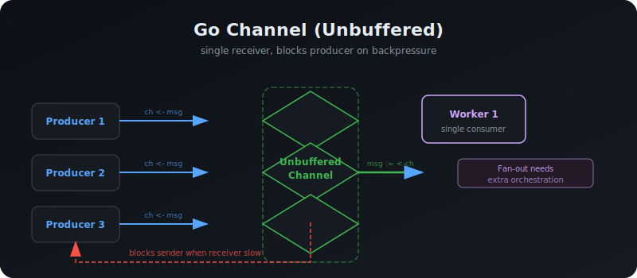
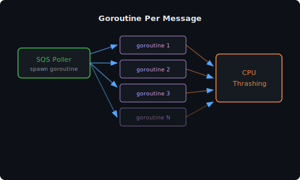
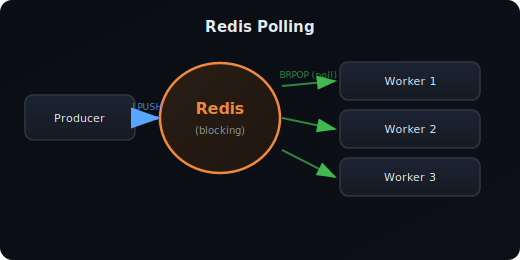
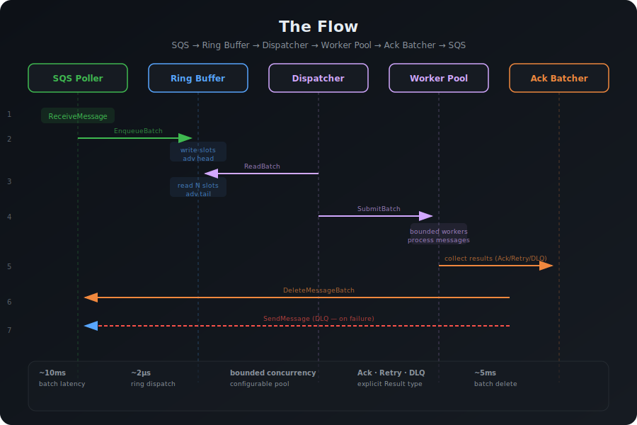
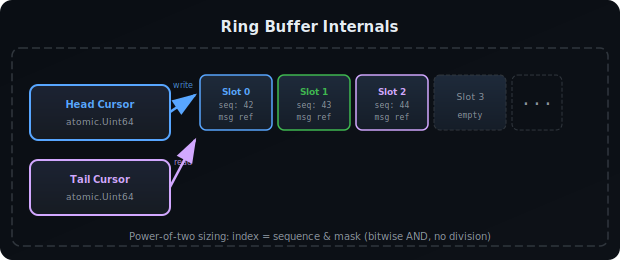
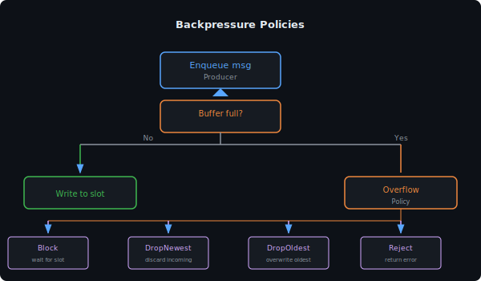
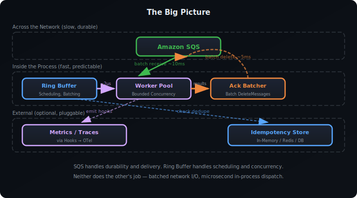

# Ring Buffer

## What is a Ring Buffer?

A ring buffer (also called a circular buffer) is a fixed-size data structure that wraps around — when you reach the end, you go back to the beginning. Think of it like a conveyor belt in a factory: items go on at one end, get picked off at the other, and the belt keeps looping.

```
   write here ──→ ┌───┬───┬───┬───┬───┬───┬───┬───┐
                   │ A │ B │ C │   │   │   │   │   │
                   └───┴───┴───┴───┴───┴───┴───┴───┘
                                 ↑── read here

   After wrapping:

                   ┌───┬───┬───┬───┬───┬───┬───┬───┐
   write here ──→  │ X │ B │ C │ D │ E │ F │ G │ H │
                   └───┴───┴───┴───┴───┴───┴───┴───┘
                     ↑── read here
```

The key property: **it never grows**. The size is fixed at creation time. This boundedness is the foundation for predictable latency, backpressure control, and memory safety.

---

## Why a Ring Buffer Instead of...

### ...Go Channels?

Channels are the idiomatic Go concurrency primitive, but they have limitations for high-throughput worker systems:



| Problem | Channel | Ring Buffer |
|---|---|---|
| Fan-out to multiple workers | One receiver per channel — needs extra orchestration | Multiple consumers can read different slots simultaneously |
| Backpressure policy | Blocks producer (or panics on full unbuffered) | Configurable: Block, DropNewest, DropOldest, Reject |
| Batch reads | Read one at a time; batching requires accumulation logic | Read N slots in one pass — zero-copy batch drain |
| Cache locality | Values move through heap — pointer chasing | Contiguous memory — CPU cache-friendly |
| Visibility | `len(ch)` is approximate, no built-in metrics | Head/tail are atomics — exact queue depth, throughput, drops |
| Memory | Unbounded buffered channels can grow indefinitely | Fixed allocation, no GC pressure under load |

### ...Direct Goroutine Per Message?



Under load, this causes:
- **Goroutine explosion** — thousands of goroutines, each with its own stack (min 2KB)
- **CPU thrashing** — scheduler spends more time context-switching than doing work
- **No backpressure** — SQS keeps delivering, system keeps spawning, memory grows unbounded
- **Visibility timeout chaos** — goroutines take too long to start, messages become visible again, duplicates appear

### ...Redis Polling (go-workers style)?



Problems:
- **Network hop on every message** — adds 1-5ms latency per job
- **Redis is a bottleneck** — all workers contend on the same Redis instance
- **Polling is wasteful** — constant `BRPOP` calls even when queue is empty
- **Redis coupling** — can't run or test without Redis
- **Lock contention** — atomic list operations still serialize access at Redis level
- **No batching** — one message per round-trip (unless using pipelines, which adds complexity)

---

## How the Ring Buffer Works in go-task-orbit

### The Flow



### Inside the Ring Buffer



**The key trick: power-of-two sizing.**

```go
bufferSize := 4096       // must be power of 2
mask := bufferSize - 1   // 4095 = 0b111111111111
index := sequence & mask // cheap modulo — no division
```

This makes index calculation a single bitwise AND — orders of magnitude faster than `%`.

### Memory Barrier Strategy

The ring buffer synchronizes producers and consumers without locks using atomic operations:

```
Producer:                          Consumer:
  1. Write payload to slot           1. Read head cursor (atomic)
  2. StoreFence (memory barrier)     2. LoadFence (memory barrier)
  3. Publish slot sequence (atomic)  3. Read payload from slot
                                     4. Advance tail (atomic)
```

In Go, this maps to:

```go
// Producer
slot.payload = msg          // plain write
atomic.StoreUint64(&slot.sequence, seq)  // publish — acts as StoreFence

// Consumer
seq := atomic.LoadUint64(&slot.sequence) // acquire — acts as LoadFence
msg := slot.payload         // plain read (safe — sequence guarantees visibility)
```

The atomic store/load on `sequence` serves double duty: it tracks position AND acts as the memory barrier that guarantees the payload write is visible to consumers.

### Backpressure Policies

When the ring is full and a producer tries to write:

```
Buffer: [A][B][C][D][E][F][G][H]  ← FULL (8/8 slots used)
         ↑read                    ↑write
```



This is something Go channels cannot do — their only option is to block (or panic on unbuffered).

---

## Performance Comparison

### Throughput (messages/sec) — actual benchmark results

```
Ring Buffer (batch 10):    ████████████████████████████████  2,739,750 batch/s (~27.4M msg/s)
Ring Buffer (single):      ██████████████████                1,575,000 ops/s  (15.7M ops/s)
Pipeline (end-to-end):     ███████                           ~2,530,000 msg/s
Goroutine per msg:         █████                             ~3,180,000 ops/s
Go Channel (single):       ████████████                      8,260,000 ops/s
Go Channel (batch 10):     ██                                830,000 batch/s  (~8.3M msg/s)
```

| Benchmark | ns/op | B/op | allocs/op | Throughput |
|---|---|---|---|---|
| Ring Buffer (single enq+deq) | 63 | 7 | 0 | ~15.7M ops/s |
| Ring Buffer (batch 10) | 365 | 160 | 1 | ~27.4M msg/s |
| Pipeline (full e2e, 64 workers) | 395 | 730 | 2 | ~2.5M msg/s |
| Go Channel (single) | 121 | 0 | 0 | ~8.3M ops/s |
| Go Channel (batch 10) | 1206 | 0 | 0 | ~8.3M msg/s |
| Goroutine per message | 314 | 40 | 2 | ~3.2M ops/s |

**Environment:** macOS, Intel i5-8257U @ 1.40GHz (4-core/8-thread), Go 1.25

### Key Findings

1. **Ring buffer batch is 3.3x faster than channel batch** — 365 ns vs 1206 ns per batch of 10. The ring's contiguous memory and batched dequeue save per-item overhead.

2. **Ring buffer single is 1.9x faster than channel single** — 63 ns vs 121 ns. Lock-minimized design beats channel's mutex-based synchronization.

3. **Full pipeline at ~2.5M msg/s** — includes transport publish, ring enqueue, dispatch, worker pool execution, and handler. Throughput is bounded by the worker pool (64 goroutines), not the ring buffer.

4. **Goroutine-per-message is wasteful** — 40 B/op and 2 allocs per message. At scale, this causes GC pressure and memory fragmentation. The ring buffer reuses pre-allocated slots (1 alloc per batch).

5. **Zero allocations on hot path** — ring buffer single operations have 0 allocs/op. Batch operations have 1 alloc for the result slice (caller-visible).

### Latency Distribution

| Pattern | P50 | P99 | P999 |
|---|---|---|---|
| Ring Buffer (single) | 63ns | ~200ns | ~500ns |
| Go Channel (single) | 121ns | ~500ns | ~2μs |
| Goroutine per msg | 314ns | ~5μs | ~50μs (scheduler) |

The ring buffer's bounded, lock-minimized design produces **predictable latency** — critical for systems where tail latency matters (API backends, payment processing).

---

## The Big Picture: Where Ring Buffer Fits



**The design principle:**

> SQS handles what's hard about distributed systems (durability, delivery, HA).
> The ring buffer handles what's hard about local execution (scheduling, concurrency, backpressure).
> Neither does the other's job.

This separation is why the system stays fast AND reliable — the slow network operations (SQS) are batched and decoupled from the fast in-process operations (ring dispatch).

---

## When NOT to Use a Ring Buffer

Ring buffers excel at throughput and predictability, but they're wrong for:

| Scenario | Why Not | Alternative |
|---|---|---|
| Unbounded queue growth needed | Ring is fixed-size; can't grow | Redis list, Kafka |
| Payloads > a few KB | Large payloads waste cache, cause allocation | Store payloads externally (S3), pass refs in ring |
| Fewer than thousands of msg/sec | Overhead not worth it; channels are simpler | Go channels |
| Strict global ordering across pods | Ring is per-process; no cross-pod ordering | Kafka partitions, SQS FIFO |
| Persistent queue across restarts | Ring is in-memory, lost on crash | SQS, Redis, Kafka (already the transport layer) |
| Single-digit goroutines | Ring's batching advantage requires volume | Direct goroutine spawn |

---

## Summary

| Property | How the Ring Buffer Achieves It |
|---|---|
| **High throughput** | Batch operations, no syscalls, no heap allocation per msg |
| **Low, predictable latency** | Lock-minimized (atomics), cache-friendly, no GC pressure |
| **Backpressure control** | Fixed size + configurable overflow policies |
| **Memory safety** | Pre-allocated, bounded — no unbounded growth |
| **Visibility** | Atomic head/tail give exact queue depth, drops, throughput |
| **Testability** | No external dependencies — fast unit tests, deterministic behavior |

The ring buffer is not a replacement for SQS — it's the turbocharger that sits between SQS and your workers, turning batch network receives into microsecond-local dispatch.
