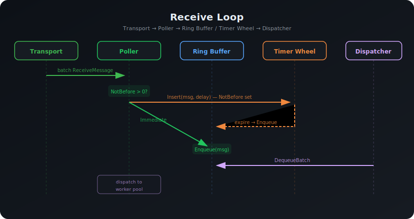
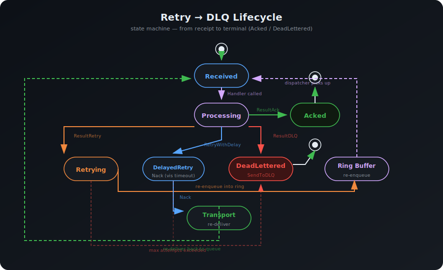
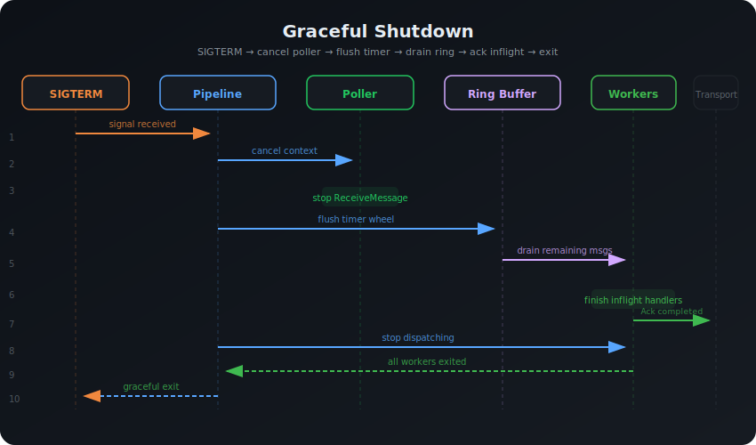

# Architecture

go-task-orbit is a cloud-native async execution runtime with ring-buffer scheduling and pluggable transports.

## Pipeline

## Receive Loop

## Retry → DLQ Lifecycle

## Graceful Shutdown

